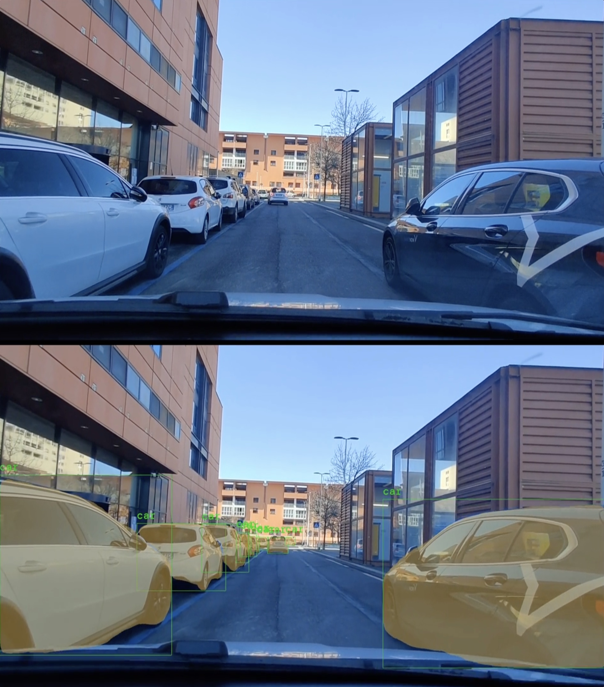

# Inference-optimizer-for-video-stream-Masked-RCNN

Fast python notebook and script to make inference from a pretrained model (like [maskRCNN-resnet50](https://pytorch.org/vision/main/generated/torchvision.models.detection.maskrcnn_resnet50_fpn.html) used here).

At inference time, during the video export, the optimization involves to store a large amount of images. When using **openCV**, export times are about 3 times long compared to those obtained using **ffmpeg**. However, it is not possible to obtain a real-time export (therefore at least *24 frames per second*), but the performances are still optimized, managing to obtain about *15fps* on CPU M1 Max (from Apple).

The picture below shows input and output example: 

TODO: The code has not been ordered yet.